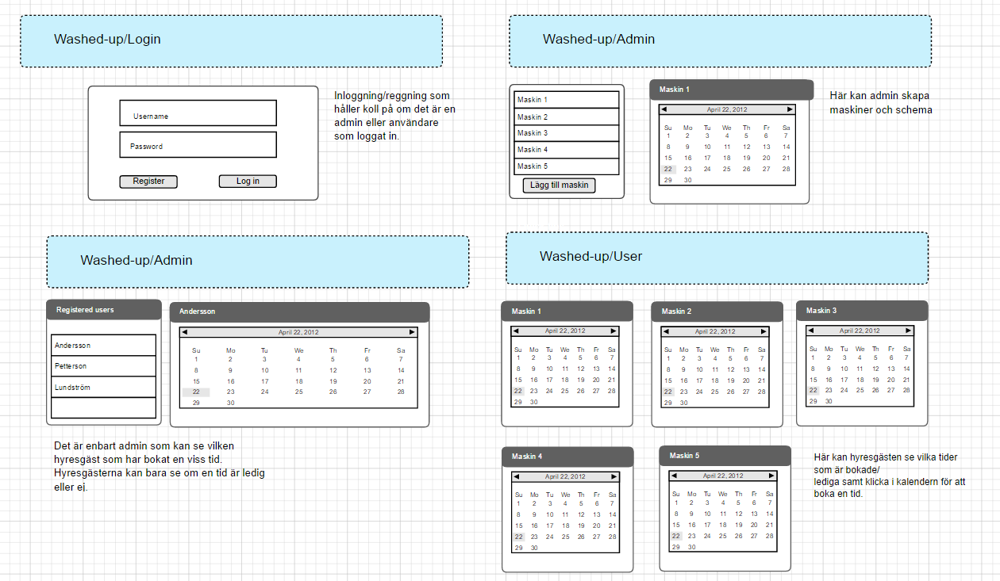

# washed-up
MEAN-app för att schemalägga tider i tvättstugan

Målgruppen är ni som är trötta på arga lappar i tvättstugan för att ni tagit fel tvätttid.

# Funktioner

Administratören ska kunna skapa upp scheman för tillgängliga tvättmaskiner.

Hyresgästerna ska få tillgång till ett användarvänligt schema som visar vilka
maskiner som är upptagna samt kunna boka en tid.

# Milstolpar

1. Skapa ett backend med node, express, mongo och mongoose.
2. Använda passport för auth.
3. Skapa frontend med Angular och skriva tester för funktioner.
4. Skapa vyer för uppvisning av data.

  

